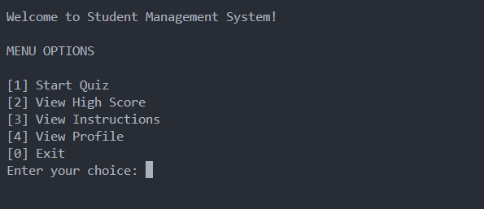
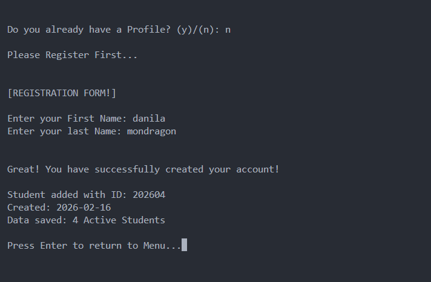
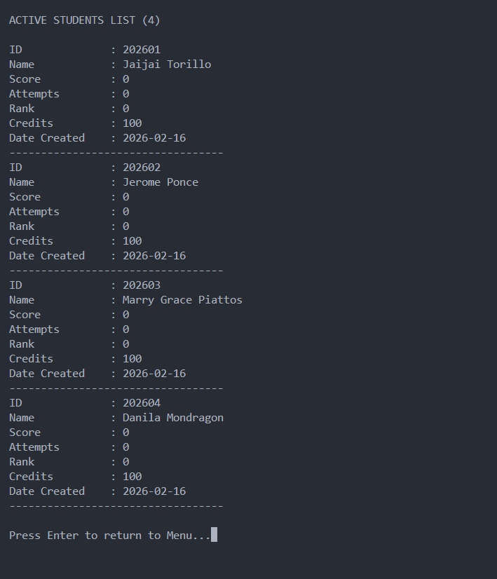
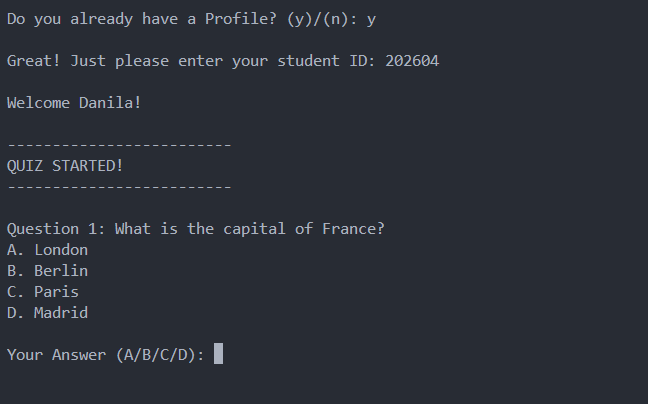

# Menu-Driven-Program (Student Management System)

## Description

This program is a student management system that allows you to add, remove, and list students. The program uses a menu-driven interface to perform these operations. It is a console based application using OOP concepts and File I/O.

This serves as a demonstration of my ability to use OOP concepts, File I/O, and menu-driven interfaces to create a student management system.

## Features

- Create a new student profile.
- Read or Display a student profile.
- Update a student profile details or save to a backup file.
- Delete a student profile.
- List all active students.
- Let the user take a Quiz.
- Exit the program.

## Concepts Used

- Object-Oriented Programming (OOP)
- File I/O
- Menu-driven interface
- Data validation
- Exception handling
- Error handling

## Usage

1. Run the program.
2. Select an option from the menu.
3. Follow the prompts to perform the desired operation.

## Author

- Name: Donnie Amodia

## GitHub Repository

https://github.com/daun-codes/CPP-Activities-Portfolio

## Sample Output

Welcome to the Student Management system!

MENU OPTIONS

1. Create a new student profile
2. Read or Display a student profile
3. View Instructions
4. Delete a student profile
5. List all active students
6. Let the user take a Quiz
7. Exit the program

Entere your choice: 1

Enter your First Name: Donnie

Enter your last Name: Amodia

Thanks for registering, Donnie Amodia!

Quiz Begin!

## Screenshots

- Menu Options

- Add Student Profile

- Read or Display a student profile

- Quiz

